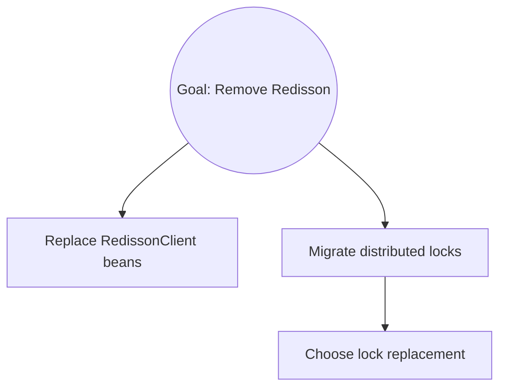

# The Mikado Method, in 5 minutes

The Mikado Method ([Brolund and Ellnestam, 2014](https://mikadomethod.info/)) is a way to make large codebase changes by **discovery**, not planning.

## The premise

When you stare at a refactor that touches many places, the temptation is to plan it out: enumerate what needs to change, sketch the new architecture, then start typing. That fails for two reasons:

1. **Real codebases hide their dependencies.** You will miss prerequisites. The plan starts looking nothing like reality after the third file.
2. **Half-done refactors are toxic.** Once your tree is broken, every commit becomes a compromise between "make tests pass" and "finish the refactor." You lose the option to ship anything.

The Mikado Method inverts this. Instead of planning, you let the codebase tell you what its prerequisites are.

## The loop

```
1. State a concrete goal.
2. Attempt it the most obvious way, in an isolated worktree.
3. Whatever breaks reveals prerequisites.
4. Discard the experiment. Record prerequisites in a graph.
5. Pick a leaf prerequisite. Implement it on the real branch. Commit.
6. Repeat 2-5 until the goal can be implemented cleanly.
```

Each leaf, when implemented in isolation, leaves the tree green. The tree is never broken. Reverts are cheap because every commit is small and focused.

## The artifact

The artifact you produce is **the prerequisite graph**, not the experimental code. The experimental code is throwaway by design — its only purpose was to surface failures.

The graph captures everything you learned about the codebase. When the graph is complete and every node is checked off, the goal becomes the final leaf.



## Why it matters for AI agents

Two of the method's "rules" are notoriously hard for human developers:

- **Don't fix during the naive experiment** — humans see a broken test and reach for the keyboard.
- **Revert is free** — humans get attached to working code, even experimental code.

Agents don't have either problem. `git revert` is just a command. The naive experiment is just a sensor. Removing those two failure modes makes the method dramatically more effective with an agent than it ever was with humans alone.

## What you don't get

The method does **not** give you:

- A faster path through the refactor. The first naive experiment will surface most prerequisites, but there will be deeper layers you can only discover by attempting the leaves.
- Free architectural insight. The graph tells you what depends on what, but not whether your design choice is good.
- Consensus from your team. The graph is your record; reviewers still need to see the resulting MR.

What you do get is:

- A tree that is always green between leaves.
- Commits small enough that any one of them can be reverted without ceremony.
- A complete record of every prerequisite you discovered, in graph form, that can be attached to the MR.

## Read more

- The original book: [The Mikado Method](https://mikadomethod.info/) (Brolund & Ellnestam, Manning 2014).
- A longer write-up on the method's fit for AI agents: [wellaged.dev/posts/mikado-method-ai-agents](https://wellaged.dev/posts/mikado-method-ai-agents/).
