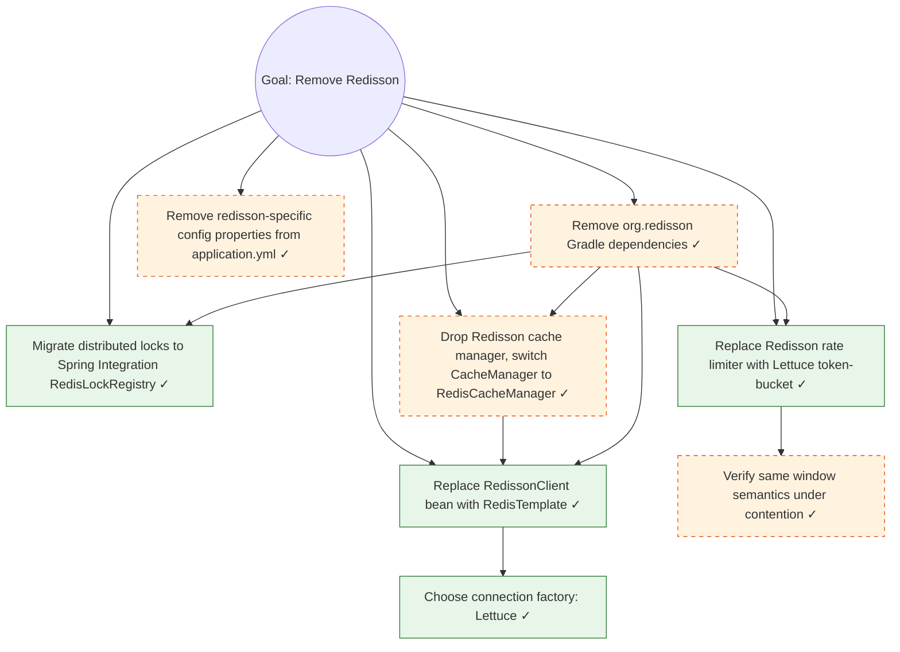

# Mikado Goal: Remove Redisson, replace with Spring Data Redis (Lettuce)

**Slug:** remove-redisson
**Started:** 2026-03-15
**Ticket:** PROJ-1234
**Branch:** chore/PROJ-1234-remove-redisson
**Build:** `./gradlew build` (commit boundary only) / per-module during leaves
**Test:** `./gradlew test` (commit boundary only) / per-module during leaves
**Commit strategy:** separate (graph check-off lands as a follow-up commit)
**Base commit:** a1b2c3d4e5f6789012345678901234567890abcd

## Goal Statement

Remove the Redisson dependency from the platform. Replace `RedissonClient`-backed cache, distributed lock, and rate-limiter usages with idiomatic Spring Data Redis (Lettuce) equivalents. The platform's Redis-backed runtime behavior must remain functionally identical: caches with the same key prefixes and TTLs, locks with the same names and timeouts, and rate limiters with the same windows.

**Implementation direction:** swap the bean wiring layer first (`RedissonClient` → `RedisTemplate` + `RedisConnectionFactory`), then migrate consumers one subsystem at a time. Distributed locks move to Redis SETNX with explicit TTL; rate limiting moves to a Lettuce-backed token-bucket implementation.

## Acceptance

- All `org.redisson:*` Maven coordinates removed from every Gradle module.
- No source file imports `org.redisson.*`.
- Cache hit rate and TTL distribution unchanged in QA load test.
- Distributed lock acquire/release round-trip latency within ±10% of the Redisson baseline.
- All module test suites green.
- Production redis instance untouched; only the client library changes.

## Status

Complete (2026-03-22). All seven prerequisites landed on `chore/PROJ-1234-remove-redisson`. MR open at !4521.

## MR

- !4521: PROJ-1234 // chore: remove Redisson, migrate to Spring Data Redis (Lettuce)

## Mikado Graph

Legend: solid green = observed failure in naive experiment; dashed orange = anticipated, confirmed by re-experiment after the observed leaves landed.

## Prerequisites

**Observed (from naive experiment, via compile errors after deleting Redisson dependency):**

- [x] **P1.** Replace `RedissonClient` bean with `RedisTemplate<String, Object>` + Lettuce connection factory
  - Files: `RedisConfig.java`, `CacheConfig.java`
  - Naive attempt deleted Redisson dep; compile broke at every `@Autowired RedissonClient` site (six classes).
  - Decision (P1a): Lettuce over Jedis. Lettuce is async-by-default, Spring Boot's preferred client, and the platform's reactive components benefit from it.

- [x] **P2.** Migrate distributed locks
  - Files: `JobScheduler.java`, `WebhookDeliveryService.java`, `BatchImportLockManager.java`
  - Three call sites used `RedissonClient.getLock(name).lock(timeout, unit)`. Replaced with Spring Integration's `RedisLockRegistry` (`obtain(name).tryLock(timeout, unit)`).
  - Lock keys preserved exactly; existing locks held during deploy will expire normally because TTLs match.

- [x] **P3.** Replace rate limiter
  - Files: `IngestionRateLimiter.java`, `ApiKeyRateLimiter.java`
  - Redisson's `RRateLimiter` with `OVERALL` window + per-second permits → custom Lettuce `EVAL` script implementing token-bucket with the same window/refill semantics.
  - **P3a:** verified under 50-thread contention test that the new implementation produces the same throughput envelope (±2% over a 60-second window).

**Anticipated (from plan, confirmed via re-experiment after P1-P3):**

- [x] **P4.** Drop `RedissonSpringCacheManager`, wire `RedisCacheManager` instead
  - File: `CacheConfig.java`
  - Cache key prefixes and TTLs preserved via `RedisCacheConfiguration.defaultCacheConfig().entryTtl(Duration.ofMinutes(...))`.
  - The Redisson `CacheConfig` JSON file (`redisson-cache.yml`) was removed; its prefix/TTL settings are now expressed as `RedisCacheConfiguration` beans.

- [x] **P5.** Remove `org.redisson:redisson-spring-boot-starter` and `org.redisson:redisson` Gradle deps
  - Files: `build.gradle` (root), `app/build.gradle`, `worker/build.gradle`
  - Verified zero remaining Redisson imports via `grep -rn "org.redisson" --include='*.java'`.

- [x] **P6.** Remove `redisson:` config block from `application.yml` and per-environment overlays
  - Files: `application.yml`, `application-dev.yml`, `application-qa.yml`, `application-prod.yml`
  - Helm values removed in a follow-up commit on the same branch (`charts/myapp/values.yaml`).

## Notes and learnings

- **The naive experiment under-sampled.** I expected ~3 prerequisites; the experiment surfaced 4. The fourth (P4 cache manager) only became obvious after P1's bean replacement compiled. The Redisson cache manager was wired separately, and the compiler didn't flag it until I ran `./gradlew :app:test`.
- **Lock key compatibility matters.** The Redisson lock and Spring Integration's `RedisLockRegistry` use slightly different internal key formats. We preserved the user-facing lock name but accepted that any locks held during deploy would briefly fail to coordinate across the cutover. Mitigated by deploying during a low-traffic window.
- **Rate-limiter cutover required dual-write briefly.** For two hours, both the Redisson and Lettuce rate limiters were active so that throttling state didn't reset to empty on deploy. This wasn't a leaf; it was a deploy-time concern surfaced in P3a's verification. Documented in the MR description.
- **Pre-existing flake observed but out of scope:** `WebhookDeliveryServiceTest.shouldRetryOnRedisOutage` was flaky on `develop` before this work started. Not introduced by this goal; tracked separately.
- **Open questions resolved during the goal:**
  1. Lettuce vs Jedis (P1a) → Lettuce
  2. Custom token-bucket vs Bucket4j (P3) → Custom EVAL script (Bucket4j has its own Redisson backend that we'd inherit indirectly)
  3. Whether to remove the Helm chart's redis StatefulSet → No, keep as-is. Only the client library changes.

---

This file is a sanitized, illustrative version of a real Mikado goal. Project-specific names, ticket keys, and module paths have been genericized. The shape, level of detail, and the pattern of "observed → anticipated → re-experiment confirms" matches what real goals look like in production.
