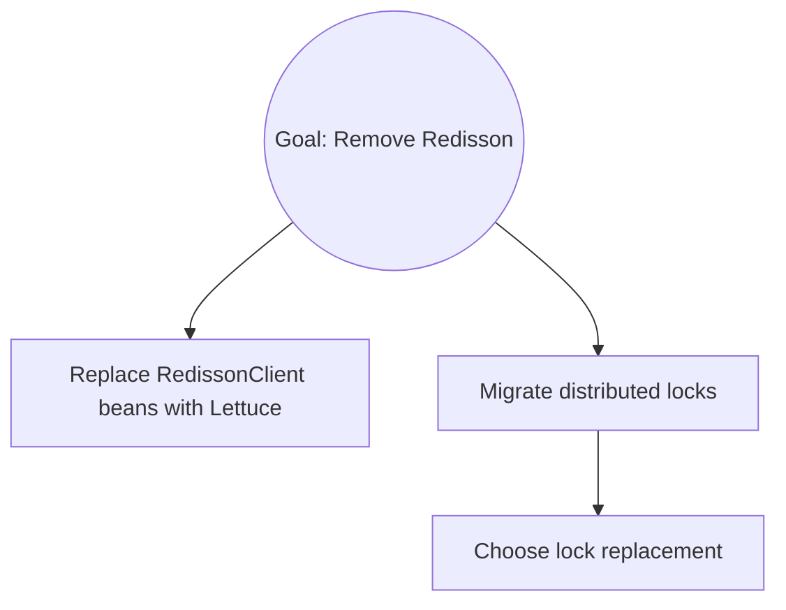

# Mikado Method

The Mikado Method makes large codebase changes by discovery, not planning. The loop:

1. State a concrete goal.
2. Attempt it naively in an isolated worktree.
3. Whatever breaks reveals prerequisites.
4. Discard the worktree; record prerequisites in a Mermaid graph.
5. Pick a leaf prerequisite, implement it on the feature branch, commit.
6. Repeat until the goal can be implemented cleanly.

The prerequisite graph is the artifact. Experiment code is throwaway.

## Inputs

Invoked as `/mikado <goal>` or `/mikado <path-to-spec.md>`. The argument is either:
- A direct prose goal: `/mikado remove Redisson and migrate to Lettuce`
- A path to a spec file: `/mikado docs/specs/remove-redisson.md`

Derive a short kebab-case slug from the goal for filenames. Example: "Remove Redisson and migrate to Lettuce" → `remove-redisson`.

## Operating rules (read before acting)

- **Safe git operations allowed; never push or rewrite history.** Claude owns local git state while the goal is in progress: create feature branches, stage specific files, commit, revert, cherry-pick, stash, restore, rename or delete merged branches. Claude does NOT push, pull, merge, rebase, reset, force-delete branches, or clean. Show `git status --short` and `git diff --stat` before each commit so the user can interject. `EnterWorktree` / `ExitWorktree` are allowed because they don't mutate the feature branch.
- **Resist fixing during experiments.** The naive attempt's only job is to surface failures. If you start fixing things in the worktree, you lose the signal. Exit and record.
- **One leaf per commit.** Do not bundle unrelated prerequisites.
- **Update the graph before touching code.** The graph should always lead the code, not trail it.
- **Revert is free.** If an experiment needs more than a handful of changes before you can run tests, you're probably fixing instead of experimenting. Exit and re-scope the leaf.
- **Use the narrowest verification that proves the change.** For pure refactors (type swaps, renames, file deletions with verified zero references): compile-only is sufficient — skip tests. For logic changes: single-class `--tests <ClassName>` filter, not module-level. Module-level tests are a yellow flag requiring explicit justification. Full module suites run at the commit boundary before the MR, not per-leaf. Wrapper skills may codify project-specific narrow-test commands; defer to them.
- **Fold codegen byproducts into the producing leaf.** Auto-generated files (OpenAPI specs, API clients, lockfiles) regenerate deterministically from their source. When a leaf causes them to regenerate, stage and include them in the same commit as the leaf — do not create separate `chore: regenerate X` commits. The exception is when codegen regenerates on its own schedule (unrelated churn); that's the only case where a standalone regen commit is correct.
- **Subagent timeout recovery.** If a subagent returns without committing (timed out mid-test, returned control prematurely, hit a silent error), verify its work in the main session before redelegating. If acceptance criteria are met — modified files are coherent, narrow test suite is green — commit the staged work directly. If the work is incomplete or incoherent, revert the uncommitted changes and re-delegate. Do not spin a fresh subagent on top of half-finished work.

## Agent-safe git: six properties this skill upholds

Adapted from [GitButler's agent-safety framework](https://blog.gitbutler.com/agentic-safety). Useful as a check when adding a new operation or loosening a rule.

1. **Task isolation.** One goal = one feature branch (and, for experiments, one throwaway worktree). Never mix two goals on the same branch.
2. **Clear branch boundaries.** The skill never silently switches branches. Branch creation is allowed; branch switching is not. If a goal needs to move to a different base, stop and ask.
3. **Explicit commit selection.** Stage specific files; never `git add -A` or `git add .`. The user sees each commit's diff stat before it lands.
4. **Easy pre-push review.** The user owns `git push`. Every leaf commit is local until the user decides to publish. MR creation (`/mikado-mr`) also requires explicit confirmation.
5. **Cheap rollback.** `git revert`, `git restore --staged`, and `git stash push`/`pop`/`apply` are all allowed so the skill can undo its own work without human friction. Destructive undo (`git reset --hard`, `git clean`, `git branch -D`, `git stash drop/clear`) stays denied — those lose data silently.
6. **Cross-branch damage prevention.** `git checkout -- <file>` is denied (use `git restore` instead, which is explicit about what it touches). `git switch -C` is denied (force-overwrites a branch pointer). `git clean` is denied (kills untracked files).

## Phase 0: Preflight

Run in sequence:

1. `git status --short` — must be empty. If not, ask the user to stash or commit before continuing.
2. `git rev-parse --abbrev-ref HEAD` — must not be a protected branch (`main`, `master`, `develop`, `release/*`, `hotfix/*`). If it is, ask the user to create a feature branch first.
3. Detect build/test commands from project structure if not supplied by a wrapper skill:
   - `build.gradle` / `settings.gradle` → Gradle
   - `package.json` → npm/pnpm/yarn (check lockfile)
   - `pyproject.toml` / `Pipfile` → Python (ask user which runner)
   - Polyglot repos: ask the user which subsystem the goal targets.
4. Ensure `.mikado/` exists; create it if not.

## Phase 0.5: Resume detection and reconciliation

If `.mikado/<slug>.md` already exists, this is a resumed session. Before picking a leaf, **reconcile the graph with the actual branch state** — the user may have committed out-of-band since last session.

1. Read `.mikado/<slug>.md`. Note the `Base commit` and `Commit strategy`.
2. `git log --oneline <base-commit>..HEAD` — list every commit since the goal started.
3. For each commit, match its subject against the graph's prerequisite list:
   - If a commit looks like it implemented a still-unchecked prereq, flag it.
   - If a commit doesn't match any prereq, note it as an out-of-band change.
4. Show the user:
   - Current status line and remaining unchecked prerequisites
   - Commits since start, with matches/mismatches highlighted
   - Any suspected unchecked-but-implemented leaves
   - The next suggested leaf
5. Ask: resume as-is, update graph to mark flagged prereqs done, or start over?

If the user resumes, apply any confirmed check-offs to the graph before Phase 4, and propose a single reconciliation commit (`mikado: reconcile graph with branch state`) if the graph changed.

If the branch `HEAD` no longer contains the `Base commit` in its ancestry (force-pushed, rebased onto a different base), stop and ask the user how to proceed — do not silently mutate the graph.

## Phase 1: Record the goal

Write `.mikado/<slug>.md` using this template (the outer four-backtick fence is only here so the inner three-backtick mermaid fence renders; write the inner version to the file):

````markdown
# Mikado Goal: <goal statement>

**Slug:** <slug>
**Started:** <ISO 8601 date>
**Ticket:** <Jira/issue key if discoverable, else omit>
**Build:** <build command>
**Test:** <test command>
**Commit strategy:** <unset — to be set on first leaf: separate|folded>
**Base commit:** <SHA of feature branch HEAD when goal started>

## Status
Discovering prerequisites.

## Mikado Graph


## Prerequisites

_(none yet; will populate after the naive experiment)_

## Notes and learnings

_(capture non-obvious facts about the codebase as you discover them)_
````

`Base commit` is the `git rev-parse HEAD` at the moment of goal creation. It anchors resume-time reconciliation (Phase 0.5) against the commits produced since.

`Commit strategy` stays `unset` until the first leaf is completed; on that leaf, ask the user whether to keep graph updates as a separate commit (`separate`) or fold them into the leaf's commit (`folded`), then update this field. For every subsequent leaf, follow the recorded strategy without re-asking.

Commit: `mikado: start goal '<slug>'`. Show the diff summary, then commit directly.

## Phase 2: Naive experiment

1. `EnterWorktree` — creates an isolated worktree off the current branch.
2. Inside the worktree, attempt the goal the most obvious way. Do not try to be clever about prerequisites. The experiment is a sensor, not an implementation.
3. Run the build; run the tests. Capture ALL failures: compile errors, test failures, runtime errors, lint warnings that would gate a commit.
4. Do NOT attempt to fix anything. Collect signal only.
5. `ExitWorktree` — discards all changes.

If the naive attempt passed on first try, the goal is itself a leaf. Jump to Phase 5.

## Phase 3: Analyze failures into prerequisites

This is where human judgment is most valuable. For each failure cluster, ask:

- **What is the root cause?** One missing parameter in `createUser(..)` might cause 50 test failures. That is one prerequisite, not 50.
- **Is this prerequisite actionable?** "Fix null pointer in BillingService" is actionable. "Make it faster" is not; decompose further.
- **Does this prerequisite obviously have its own prerequisites?** If so, note them as children, but do NOT expand them yet. Expansion happens through experiments, not speculation.

Update `.mikado/<slug>.md`:
- Add each prerequisite to the Mermaid graph
- Add each to a checklist below the graph
- Use short imperative phrases: "Extract UserService from RequestHandler"

Example:



Commit: `mikado: record prerequisites from naive attempt`. Show the diff summary, then commit directly.

## Phase 4: Leaf loop

Repeat until every prerequisite is checked.

### 4a. Pick a leaf

A leaf has no unchecked children. If multiple leaves exist, prefer one that unblocks the most parents or carries the least risk.

Use `TodoWrite` to mirror the current leaf (and its siblings) as in-session todos. Do not mirror the entire graph — the graph file is the durable record.

### 4b. Size the leaf — main vs. subagent

Delegate to a subagent via the `Agent` tool when ANY of the following are true:
- The leaf crosses subsystem boundaries (backend ↔ frontend, or different build modules with independent test suites)
- The leaf introduces a new abstraction or public class that will ripple to many callers
- Estimated change is >100 lines of non-mechanical edits (pure type-widening edits across many files, even if file count is high, are mechanical and often faster inline)
- The leaf requires interactive verification (browser test, live API call) that benefits from a fresh context summarizing the test plan
- You have already implemented two non-trivial leaves in this session (context saturation risk)

Implement in the main session otherwise. Specifically prefer main session for:
- Single-file deletions with verified zero references
- Constants-only refactors
- Graph bookkeeping and reconciliation
- Companion commits that are direct byproducts of a just-completed leaf

File count alone is a weak signal; 10 files of single-line type swaps may be faster inline than one 200-line state-management change. Judge by cognitive load, not LOC.

When delegating, the subagent prompt must include:
1. The full current contents of `.mikado/<slug>.md`
2. The specific leaf to implement, verbatim
3. Acceptance criteria: "build passes; tests pass for affected modules; no new failures anywhere; change is scoped strictly to this leaf"
4. A directive: "If this leaf turns out to have its own prerequisites (new compile/test errors you can't resolve within this leaf's scope), STOP and report them as sub-prerequisites. Do not try to fix them."

### 4c. Experiment if uncertain

If it's not obvious the leaf will apply cleanly, run a worktree experiment scoped to the leaf (repeat Phase 2 logic for the leaf). Failures become sub-prerequisites; record them in the graph and pick a deeper leaf.

### 4d. Implement cleanly on the feature branch

On the main tree, make the focused change. Run the narrowest verification that proves the change (see operating rule). For mechanical refactors, a targeted compile is often sufficient; avoid `:module:test` unless the leaf adds logic.

**Flaky-test rule.** If a test fails on first run, re-run *only that one test* once. If it passes on the second run, record the test name and behavior in the `Notes and learnings` section (`Flaky: <test name> — <symptom>`) and continue. If it fails again, treat it as a real failure and either fix within this leaf (if trivial and in scope) or record a new sub-prerequisite and revert. Do not re-run more than once; chasing flakes at the leaf level burns the session.

### 4e. Commit

Commit the leaf directly:
- Show `git diff --stat` and `git status --short` first so the user sees what's about to commit
- Compose a conventional commit message including any ticket key discoverable from the branch name
- Stage the specific files changed (not `git add -A`) and commit
- If the leaf triggered regeneration of auto-generated files (OpenAPI specs, API clients, lockfiles, etc.), stage and include those in the same commit. Do not create a separate chore commit for codegen byproducts.

Mark the leaf checked in `.mikado/<slug>.md`:
- Checkbox `[x]` in the checklist
- Append ` ✓` or strikethrough to the Mermaid node label (e.g. `P2a[Choose lock replacement ✓]`)

Consult the `Commit strategy` front-matter field:
- If `unset`: ask the user once — separate graph commit (`mikado: check off '<leaf>'`) or folded into the leaf's commit — then write the choice (`separate` or `folded`) to the front-matter and proceed.
- If `separate`: commit the leaf, then a follow-up graph commit.
- If `folded`: single commit that includes both the code change and the graph update.

Subsequent leaves must honor the recorded strategy without re-asking. Never push; the user owns remote operations.

## Phase 5: Finish the goal

When all prerequisites are checked, attempt the original goal:

1. Optional final worktree experiment to confirm nothing regressed.
2. Implement on the feature branch.
3. Run the full relevant suite.
4. Propose the final commit: something like `<type>: <goal>` with the ticket key.
5. Update the graph status to `Complete`, dated.

Offer a short retro:
- Any prerequisites that turned out unnecessary?
- Any discovered late (suggesting the naive attempt under-sampled the failure surface)?
- What you'd do differently next time.

Propose an MR/PR body summarizing the graph and commits. Do NOT open the MR; tell the user the command to run.

### MR shape: single, clustered, or stacked

The Mikado graph is itself a dependency DAG; it often maps cleanly to one of three MR shapes. `/mikado-mr` supports all three; pick based on the goal and the team's merge policy.

- **Single MR (default).** One MR per goal, covering every leaf. Fine for small-to-medium goals with a single reviewer. Matches squash-merge policies without friction.
- **Clustered MRs.** One MR per coherent subsystem cluster (e.g. backend refactor, FE changes, DB migration). Each targets the main branch independently; dependencies between clusters are managed by MR merge order, not by branch stacking. Fits squash-merge policies and gives subject-matter reviewers smaller, focused MRs. Recommended for goals that touch ≥3 subsystems.
- **Stacked MRs.** Each cluster gets its own branch; each branch targets its parent (not the main branch). The graph becomes a chain of MRs. Best for teams that don't squash-merge and have tooling like git-branchless, Graphite, or stack-pr. Incurs rebase pain when intermediate MRs merge under squash-merge policies; use only if the team has embraced stacked workflows.

Default to single for small goals, clustered for large ones. Only use stacked when the team explicitly runs a stacked workflow.

## Common failure modes to avoid

- **Planning the graph up front.** The graph is discovered through experiments. If you find yourself writing prerequisites you haven't actually observed as failures, stop and experiment.
- **Fixing during the naive attempt.** The urge is strong. Resist. Discard and record.
- **Leaves that are too big.** A leaf that crosses clear subsystem boundaries or introduces a new abstraction is an unexpanded node — re-experiment on it. Pure mechanical edits that happen to span many files are not necessarily too big; judge by cognitive load rather than LOC or file count.
- **Skipping reverts.** "I'll just keep this working code and clean up later" is how merges become disasters. The method's value comes from always returning to a known-good state between leaves.
- **Graph drift.** The graph and code must match. If the user adds a commit out-of-band, reconcile the graph before the next leaf.
- **Scope leaks between leaves.** A leaf that solves one prerequisite's symptom with a shim that touches an adjacent prerequisite's territory creates latent bugs (the FE shim displays legacy values correctly but the backend still sees them as unknown). If a leaf's implementation reaches into another prerequisite's scope, either fold the two leaves or stop and surface the leak as a sub-prerequisite.
- **Running broad tests per leaf.** Module-level test suites burn minutes and compound across leaves. Default to compile-only for pure refactors and `--tests <ClassName>` for logic changes. Full module runs are reserved for the commit boundary before opening the MR.
- **Separate codegen chore commits.** Regenerated OpenAPI specs, API clients, and lockfiles belong in the commit of the leaf that caused them to regenerate. Don't split them out.
